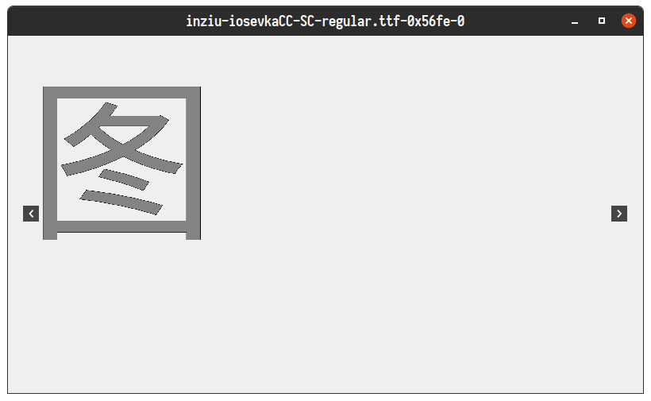
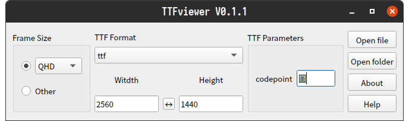

# TTFviewer

English | [简体中文](./README_zh_CN.md)

TTFviewer is a small tool for developers to view and preview various ttf font/icon image formats. It is based on Qt, and some of the code comes from the project: https://github.com/donbright/font_to_svg and https://github.com/QQxiaoming/YUVviewer , supports windows/linux/macos, the interface is simple and clear, and the operation is portable. The main interface is as follows:

## Feature

1. Select parameters on the main interface.
2. Click Open File or Folder to parse the image data and display the image.
3. Used in the image display interface
    - Scroll wheel to zoom in and out of the image,
    - Use the left button to drag the image,
    - Double click the left button to save the image as svg format,
    - Right click to reset image size and position,
    - Middle click to display the original size of the image.

### codepoint parameters

The following legal inputs exist for the codepoint parameter:

1. Enter a single character, and ttfviewer will display the image corresponding to the character's unicode in the target ttf file. Example:

    

    

    

2. Enter a hexadecimal unicode code value starting with 0x or 0X, and ttfviewer will display the image corresponding to the unicode code value in the target ttf file. Example:

    

    

    

3. Enter the wildcard *, at this time ttfviewer will search for all image displays in the target ttf file (may consume more system memory), click left and right to switch browsing. Example:

    
    
    

4. Enter double wildcards *, then ttfviewer will display the wildcard itself (ie: 0x2a) corresponding to the image in the target ttf file. Example:

    

## Format

Currently supported formats include:

ttf\ttf_verbose

## Build

　> [Build documentation](./DEVELOPNOTE.md)

## Contributing

If you have suggestions or ideas for this project, please submit issues and pull requests on GitHub or Gitee.

At present, the project will be transferred to the development based on Qt6. The current branch dev/qt6 code has been completely migrated, and the replacement of the main branch may be completed in the next LTS version of Qt6.
