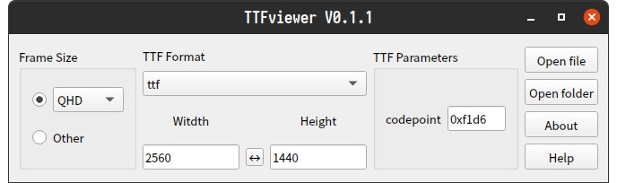

# TTFviewer

[English](./README.md) | 简体中文

TTFviewer一款用于开发人员查看预览各种ttf字体/图标图像格式的小工具，其基于Qt，部分代码来源自项目: https://github.com/donbright/font_to_svg 和 https://github.com/QQxiaoming/YUVviewer ，支持windows/linux/macos，界面简单清晰，操作便携，主界面如下：

## 功能描述

1. 主界面选择参数。
2. 点击打开文件或文件夹将进行图像数据解析并显示图像。
3. 图像显示界面中使用
    - 滚轮放大缩小图像，
    - 使用左键可拖动图像，
    - 双击左键保存图像为svg格式，
    - 单击右键复位图像大小和位置，
    - 单击中键显示图像原始大小。

## 格式支持

目前支持格式包括：

ttf\ttf_verbose

## 编译说明

　> [编译说明](./DEVELOPNOTE.md)
