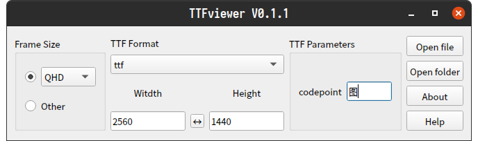
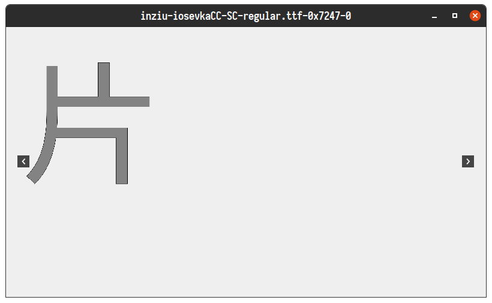
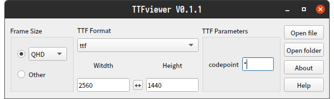
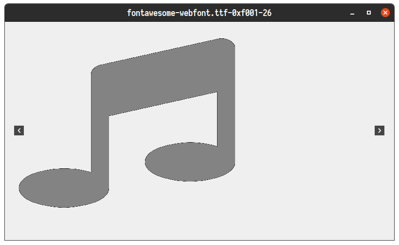
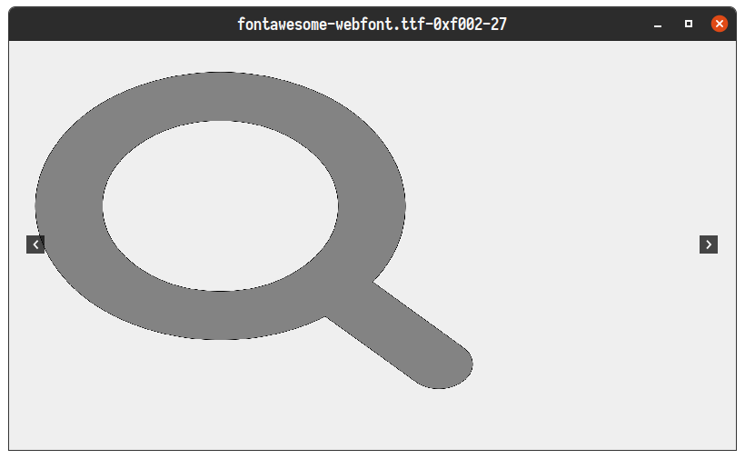
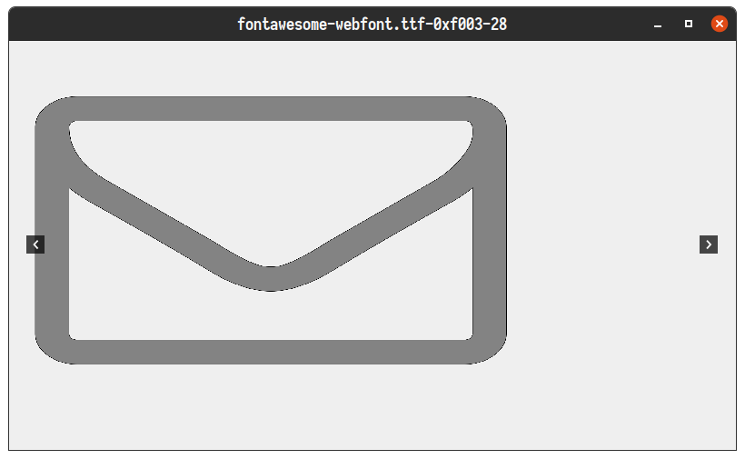

# TTFviewer

[English](./README.md) | 简体中文

TTFviewer一款用于开发人员查看预览各种ttf字体/图标图像格式的小工具，其基于Qt，部分代码来源自项目: https://github.com/donbright/font_to_svg 和 https://github.com/QQxiaoming/YUVviewer ，支持windows/linux/macos，界面简单清晰，操作便携，主界面如下：

## 功能描述

1. 主界面选择参数。
2. 点击打开文件或文件夹将进行图像数据解析并显示图像。
3. 图像显示界面中使用
    - 滚轮放大缩小图像，
    - 使用左键可拖动图像，
    - 双击左键保存图像为svg格式，
    - 单击右键复位图像大小和位置，
    - 单击中键显示图像原始大小。

### codepoint参数填写说明

关于codepoint参数存在以下合法输入：

1. 输入单个字符，此时ttfviewer会显示该字符unicode对应在目标ttf文件中的图像。示例：

    

    

    

2. 输入0x或0X开头的16进制unicode码值，此时ttfviewer会显示该unicode码值对应在目标ttf文件中的图像。示例：

    

    

    

3. 输入通配符*，此时ttfviewer会搜索目标ttf文件中的所有图像显示（可能消耗较多系统内存），点击左右切换浏览，示例：

    
    
    

4. 输入两个通配符*，此时ttfviewer会显示通配符本身（即：0x2a）对应在目标ttf文件中的图像。示例：

    

## 格式支持

目前支持格式包括：

ttf\ttf_verbose

## 编译说明

　> [编译说明](./DEVELOPNOTE.md)

## 贡献

如果您对本项目有建议或想法，欢迎在GitHub或Gitee上提交issue和pull requests。

目前项目即将转移到基于Qt6开发，目前分支dev/qt6代码已完全完成迁移，也许会在下一个Qt6的LTS版本完成main分支的替换。
